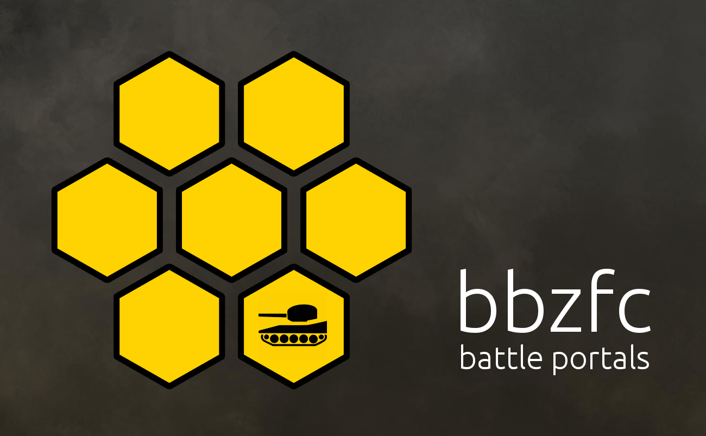

# bbzfc | An open-source system for creating Tank Battle Portals

## Documentation

Currently, the documentation is under heavy development. Most of it is incomplete and/or missing. You can take a look
at:

- [What's a Tank Battle Portal?](docs/definition_of_tank_battle_portal.md)
- [bbzfc specs](docs/bbzfc_specs.md)
- [List of possible 3D game engines](docs/possible_3d_game_engines.md)
- [For historical reference](docs/for_historical_reference.md)

## Contributing

Anyone can contribute. Clone this repository, write some code, and submit a pull request. Core contributors will be
given write access to this repository.

## Forum

A forum has been setup at [http://forum.bbzfc.net/](http://forum.bbzfc.net/). Several categories exist on the forum
for the following purposes:

- Project announcements. See the **Announcements** category.
- Day-2-day updates. See the **Blogs** category.
- General discussions about project (development, roadmap, etc.). See the **General Discussion** category.
- User concerns and requests. See the **Comments & Feedback** category.

## Real time chat

The purpose of real time chat is to quickly connect and discuss ideas and/or concerns in real time. Real time chat is
not a permanent place, so don't expect to find documentation there. Also, don't expect for real time chat logs (if such
exist) to always be available. A last note - everyone is welcome to join = )

- IRC channel. Please connect to the IRC channel **#bbzfc** on the  **freenode** server. You can find the logs of this
channel at [http://irclog.bbzfc.net/](http://irclog.bbzfc.net/).
- Slack collaboration. Access URL is [https://bbzfc.slack.com/](https://bbzfc.slack.com/) (please send an e-mail to
<admin@bbzfc.net> if you are unable to join/register on the forum).

## License

The **bbzfc** project source code is released under **The MIT License (MIT)**. Please see [LICENSE](LICENSE).
