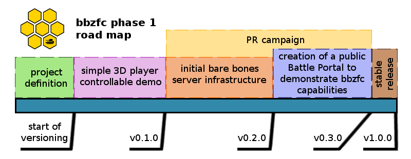

# bbzfc

An open-source system for creating Tank Battle Portals

## Documentation

Currently, you can take a look at:

- [What's a Tank Battle Portal?](docs/definition_of_tank_battle_portal.md)
- [bbzfc specs](docs/bbzfc_specs.md)
- [List of possible 3D game engines](docs/possible_3d_game_engines.md)
  - [Urho3D to be used for tank demonstrator](docs/the_choice_of_urho3d_game_engine.md)
- [For historical reference](docs/for_historical_reference.md)

## Road Map

At this stage, there is no definite timeline. Just a road map that the **bbzfc** development will try to take.

What does the **Phase 1** mean? The road map, and it's future, is discussed thoroughly in
[bbzfc project road map](docs/project_roadmap.md).

## Contributing

Anyone can contribute. Clone this repository, write some code, and submit a pull request. Core contributors will be
given write access to this repository.

## License

The **bbzfc** project source code is released under **The MIT License (MIT)**. Please see [LICENSE](LICENSE).
